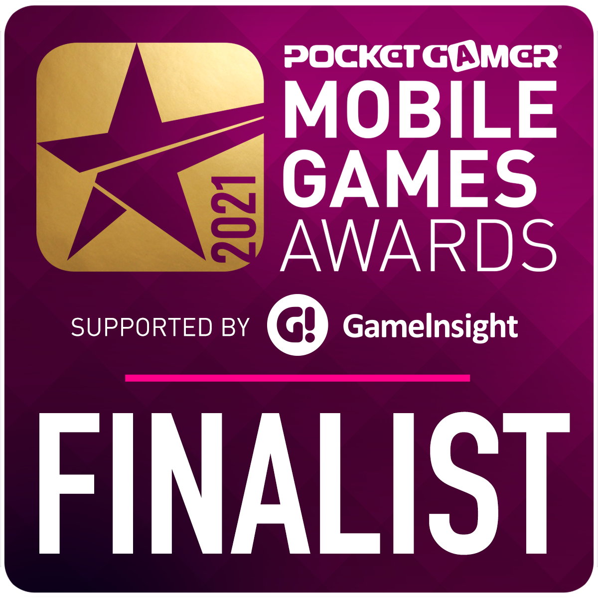

# WAM.app


Launched in February 2021 as public beta we reached more than **2.5m players** in less than 2 months with 10k players tournaments. After this initial success we decided to create the mobile apps where to this date they have been downloaded more than 30k times so far.

**Digitap** raised a traditional **pre-seed** round of $350k for **WAM.app** in November 2020 at a $3m pre-money valuation from **Voicu Oprean**, the CEO of **Arobs**, a publicly traded company on the Romanian Stock Exchange.

[https://www.crunchbase.com/organization/digitap/company\_financials](https://www.crunchbase.com/organization/digitap/company\_financials)


On **WAM.app**, the more a player wins the more their in-platform rank grows, just like normal real-life leaderboards in competitive sports. Once a player advances their rank they can participate in more rewarding tournaments with higher _entrance fees _& _reward pools_.

Each tournament has a _reward pool_ where **WAM.app **adds a fixed amount of **WAM Coins **for every player who pays the _entrance fee_. At the end of the tournament the rewards are distributed algorithmically to a percentage of the top players based on their score and ranking.


**WAM.app** was nominated as a finalist at this year’s **Mobile Games Awards** in an impressive line up of companies like Niantic and Huawei.

[https://www.mobilegamesawards.com/the-finalists-for-2021/](https://www.mobilegamesawards.com/the-finalists-for-2021/)



**WAM.app** was built with one vision in mind: to be accessible on any device and platform at any time meaning it’s accessible by going to [https://wam.app](https://wam.app) or downloading the **WAM.app** from [Google Play](https://play.google.com/store/apps/details?id=com.digitap.wam) and [App Store](https://apps.apple.com/gh/app/wam-social-games/id1555705917).

We got our inspiration from real life amateur sports tournaments where millions of people from all over the world compete in games like: football, basketball, rugby, tennis, billiards, darts and many more, just to have fun and spend time together with friends and family. The pandemic showed us the importance of sharing experiences and keeping in touch with our peers and doing it on a digital platform with people from all over the globe is the simplest way to do it.

On **WAM.app** players can:&#x20;

* participate in tournaments to win WAM Coins
* create their own tournaments where they can invite their friends and set their own participation rules
* create their own games with AI assisted technology using their phones
* trade NFTs won in specific tournaments on the marketplace
* build their player profile by winning tournaments
* grow an audience of fans


