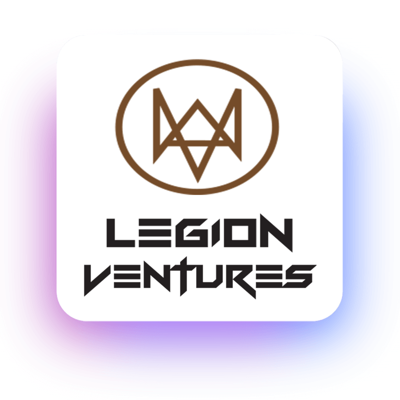
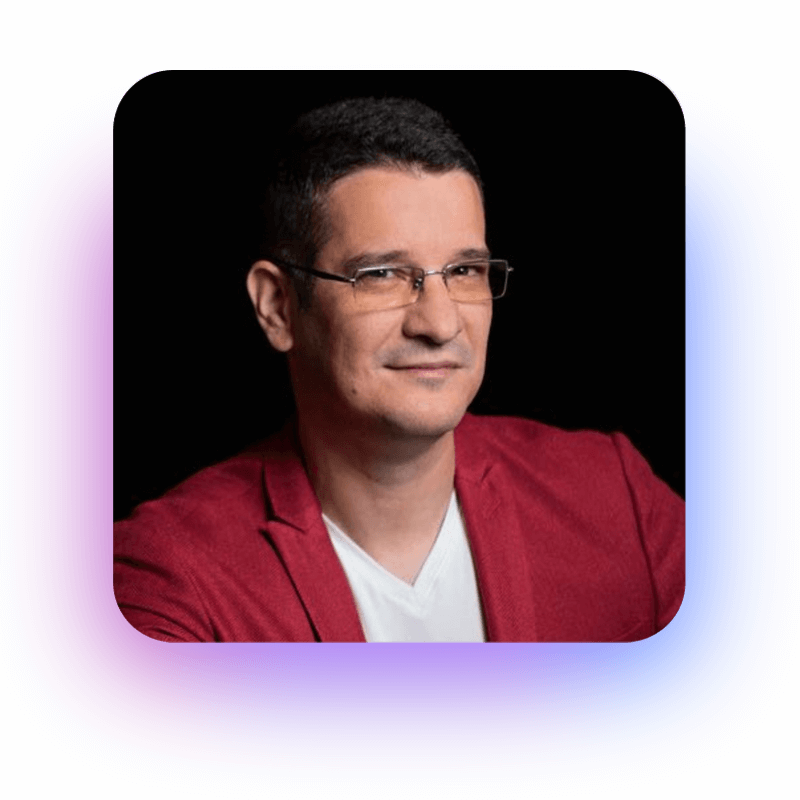
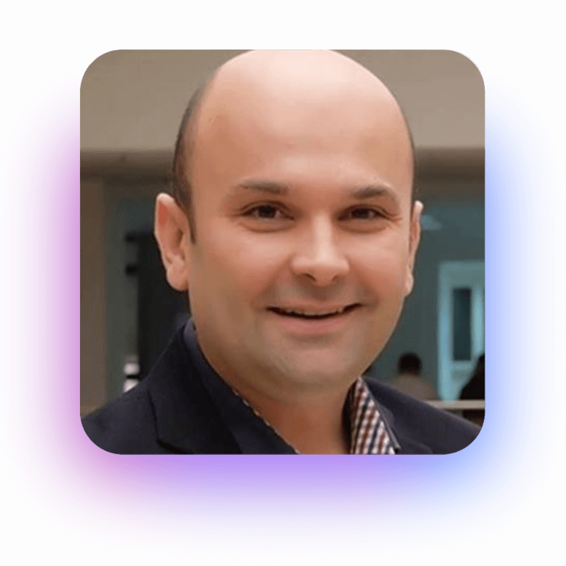

# Advisors

### Legion Ventures

Legion Ventures is the largest community of crypto investors in Romania who is dedicated to funding projects in their early stages that we deem to have a significant impact on their respective niche.

With an overall reach of over 100,000 members/followers through different social media platforms. Our members have a strong interest in learning and investing in different cryptocurrencies platforms. Legion Ventures has around 2000+ members, most being active investors since 2017 and we've individually invested and helped more than 50 projects starting from their private sale. We are now setting up a new structure with the aim of becoming the biggest community investing group in Eastern Europe.

### Sebastian Cochinescu

Sebastian is a tech entrepreneur and the CEO and founder of Tailpath.com - a technology company that adds transparency to supply chains by using public blockchains.

He has more than 20 years of business executive-level experience working with Apple, Hubert Burda Media and Avandor. In 2018 he was awarded with the Honor Emblem of the Romanian Army High Command.

He also graduated the Executive Management Program - Blockchain Academy at the University of California, Berkeley, School of Law in 2017.

### Daniel V. Ses

Bitcoin and cryptocurrencies are his biggest passions. Since 2017, he is educating people about blockchain and crypto on his YouTube channel. He's also the founder of the first Romanian publishing company that translates and publishes books about Bitcoin and cryptocurrencies: [https://iblock.ro/](https://iblock.ro).&#x20;

Daniel is a consultant as well, and help start-ups and individuals making transitions to crypto. In the past he worked in the IT industry where he founded and grew a couple of successful startups (for example StylishThemes or ChatX.ai).

### Octavian Jula

Economist with more than 20 years of experience, financial consultant, business analysis and expert accountant. Phd in Economics from 2007 with graduation of bachelor and master degrees.&#x20;

Octavian is the CEO of 2 financial advisory companies established in 2005 and 2013 where he acts as the fiscal advisor. He is highly interested in specific markets – real estate, it and retail.&#x20;

He is an Associate Professor in Economics and Corporate Governance at the Babeș Bolyai University.

### Robert Vulpe

Robert, also known in the cyber security space as **nytrOgen**, is a 24 year old security specialist, a former captain of the Romanian team at the 2019 European Cyber Security Finals.&#x20;

He studied Informatics at the University of Bucharest and is currently working with several Fortune 500 companies as a Penetration Tester.

"This role puts me in the shoes of a cyber attacker and my main objective is to penetrate the IT systems of the company that contracts me. I'm also a part of the StartCluster nucleus, a startup who's focus is to see the IT industry in a less conventional way".&#x20;

