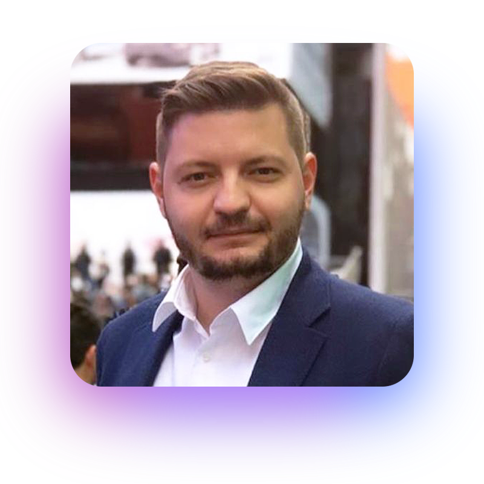
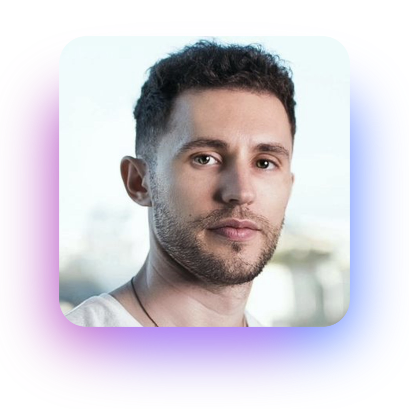
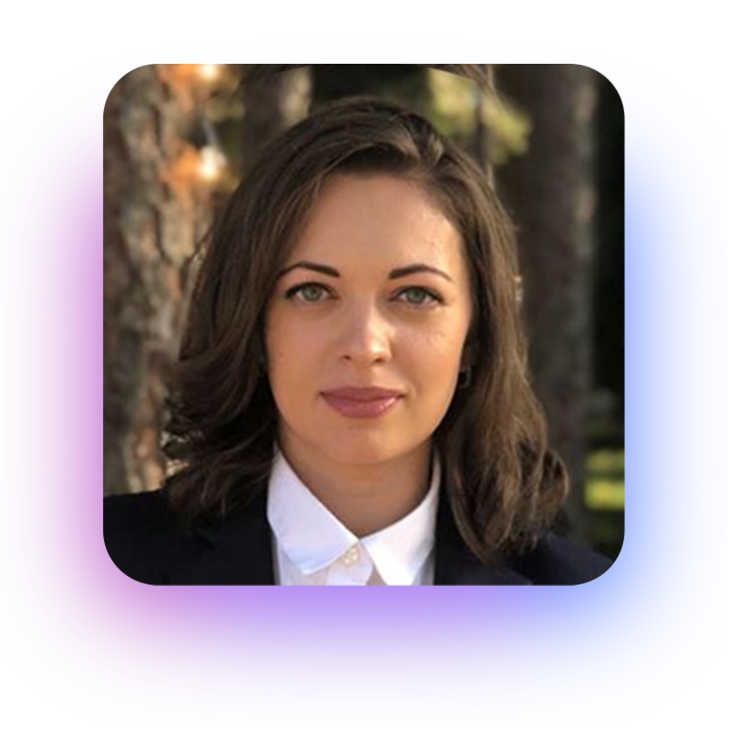
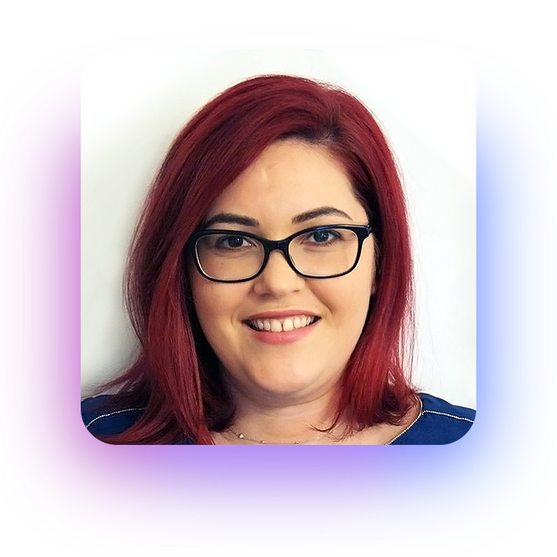
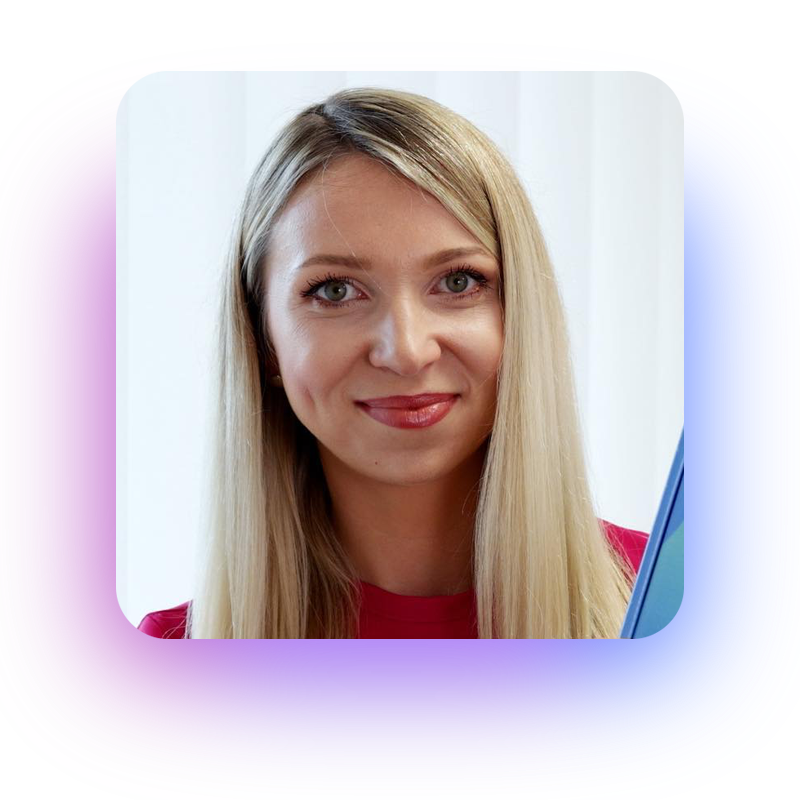
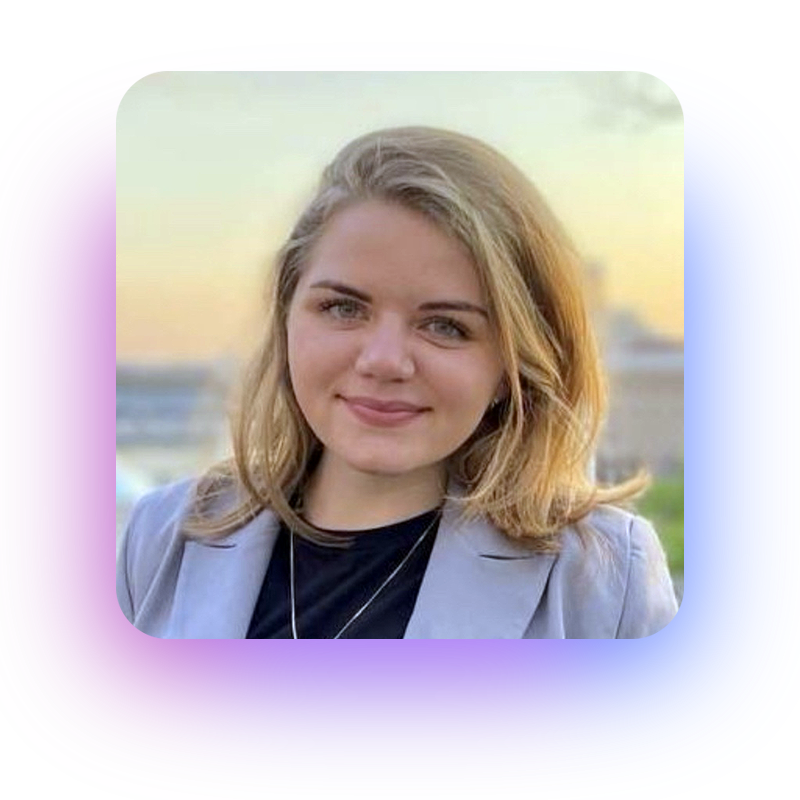
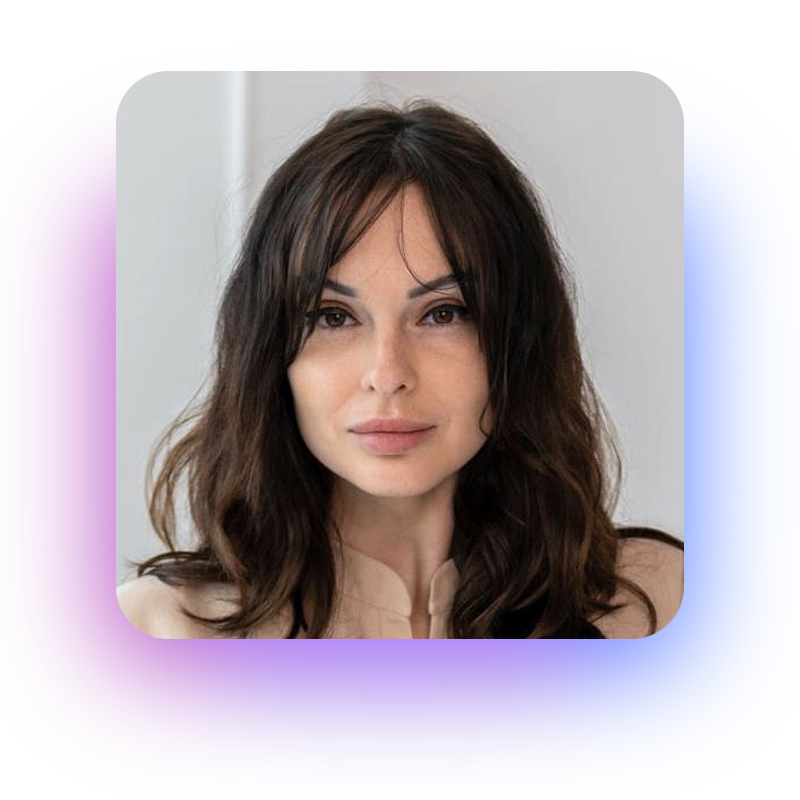
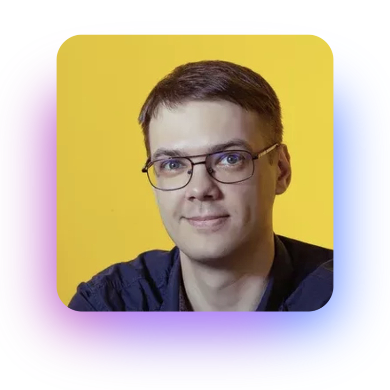
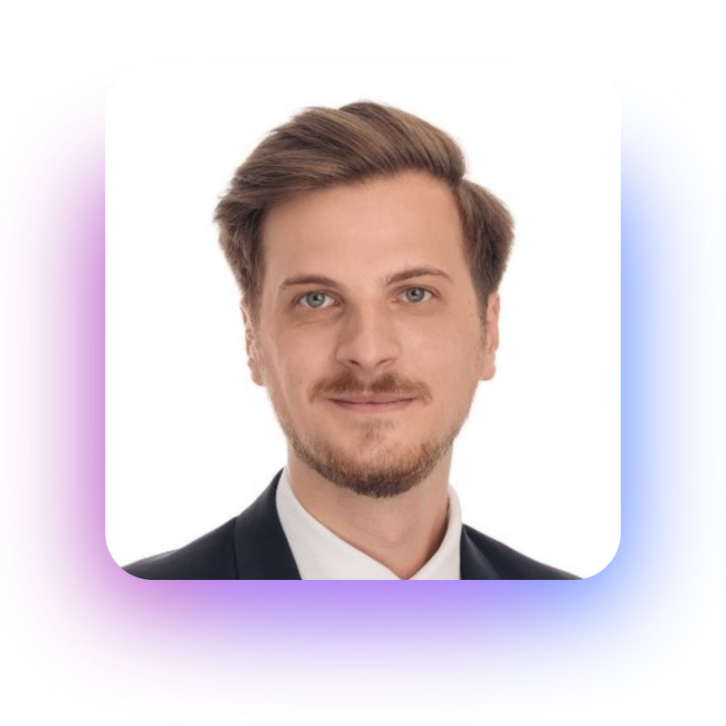
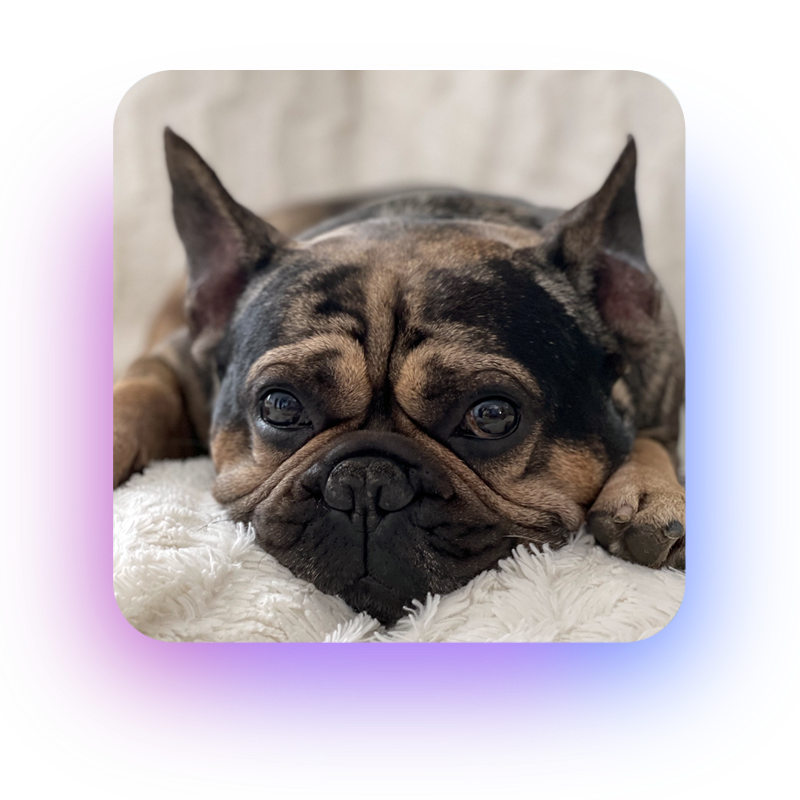

# 🦄 Team

### **Daniel Tamas – CEO**

|  (1).png>) | 
Daniel started his gaming career in 2007 cofounding IDEA Studios, an indie game studios and publisher. 

Since 2007 he and his team created more than 4000 viral online games that reached more than 3 billion players worldwide. His responsibilities varied from operations to engineering, design, business development, sales and marketing, monetisation, product development or heading the R&#x26;D department in companies that generated more than €7m to date.

In 2016 he cofounded Digitap with the purpose of pushing the boundaries of game publishing targeting the browser as a true free and open platform without gatekeepers.
 |
| :------------------------------------------------: | ------------------------------------------------------------------------------------------------------------------------------------------------------------------------------------------------------------------------------------------------------------------------------------------------------------------------------------------------------------------------------------------------------------------------------------------------------------------------------------------------------------------------------------------------------------------------------------------------------------------------------------------------------------------------------- |

### **Alex Rus – CBO**

| 
Alex’s background is social media publishing, business development and portfolio management of privately held companies in the following areas: automotive, hospitality and investment companies with more than €6 million in annual revenues having the CBO role.

In 2016 cofounded Digitap with Daniel, bringing the social media and business development expertise to the team.
 |  |
| ------------------------------------------------------------------------------------------------------------------------------------------------------------------------------------------------------------------------------------------------------------------------------------------------------------------------------------------------------------------------------------------------------- | :----------------------------------: |

### **Vlad Mustiata – CTO**

|  | 
Vlad started his career in computer science after attending the Polytechnic University of Bucharest. 

He co-founded StylishThemes and took the CTO role for 5 years, a startup that had more than 10k customers for their Wordpress custom made themes and €1m in annual revenues. Co-founder and CEO at ChatX, a smart shopping assistant 

( won the Techsylvania Runner up Award - 2017 )<strong>.</strong>
 |
| ----------------------------------------- | ---------------------------------------------------------------------------------------------------------------------------------------------------------------------------------------------------------------------------------------------------------------------------------------------------------------------------------------------------------------------------------------------------------------------------------------------- |

### **Olga Serebriakova - CMO**

| 
Olga, with more than 8 years in digital marketing has been filling the CMO role for TerraLeads where she was responsible for creating, managing and measuring the results of millions of users while coordinating a large team of media buyers, designers and content managers. 

Her overseas training and expertise gives her the ability to manage a multinational environment and a +$2m monthly advertising budget.
 |  |
| ------------------------------------------------------------------------------------------------------------------------------------------------------------------------------------------------------------------------------------------------------------------------------------------------------------------------------------------------------------------------------------------------------------------------------------------- | --------------------------------------------- |

### **Anca Tamas - CPO**

|  | 
Anca’s 10 year game producing experience coupled with extensive user acquisition knowledge and KPI measurement. Having published more than 30.000 games as head of content for several high traffic gaming websites she is leading our content strategy ( tournaments and games ).  She has been involved in the whole process of game creation ( research, ideation, game design, project management ) as well as on the marketing side of the business like game publishing, licensing and partnerships.
 |
| :------------------------------------: | ----------------------------------------------------------------------------------------------------------------------------------------------------------------------------------------------------------------------------------------------------------------------------------------------------------------------------------------------------------------------------------------------------------------------------------------------------------------------------------------------------------------------- |

### **Larisa Muresan - COO**

| 
Larisa has gained vast experience by overseeing business operations of multiple gaming companies, over a course of 6 years. 

She was solely responsible for the operational coordination of several key departments like legal, financial, accounting and hr, with more than 500 employees managed to date from hiring, contracts, salary negotiations and payments.
 |  |
| ---------------------------------------------------------------------------------------------------------------------------------------------------------------------------------------------------------------------------------------------------------------------------------------------------------------------------------------------------------------------------------------- | :----------------------------------------: |

### **Daria Avramova - PR Manager**

|  | 
Daria has been working in digital marketing for +2 years, mostly with social networks and PR.

Her background in SERM, Media Buying and Affiliate Marketing helped her get deeply experienced in the esports and gaming niche on Asian market. Daria has brilliant communicative and negotiation skills.
 |
| ------------------------------------------ | --------------------------------------------------------------------------------------------------------------------------------------------------------------------------------------------------------------------------------------------------------------------------------------------------------------------------- |

### **Asya Prokopenko - Community Manager**

| 
Asya has broad experience in Digital marketing for over 6 years while working with SEO, SMM, PR, Community management, and Content marketing.

She has a proven record of successful negotiations with new partners, setting up deals and stimulating relationships with the current ones and possesses in depth knowledge and expertise in gaming and dating verticals on US and European markets.
 |  |
| ---------------------------------------------------------------------------------------------------------------------------------------------------------------------------------------------------------------------------------------------------------------------------------------------------------------------------------------------------------------------------------------------------------------------- | :-----------------------------------------: |

### **Alexander Ivanov - Gaming Marketing Manager**

|  | 
Alex has more than 4 years of experience in performance marketing, including hands-on expertise working with promotion and analytics systems, as well as promotion of gaming projects in ASO.

In the past, he was involved in the development of media buying automation services. Alex is a person whose whole life is connected to games and the gaming industry.
 |
| :-------------------------------------: | --------------------------------------------------------------------------------------------------------------------------------------------------------------------------------------------------------------------------------------------------------------------------------------------------------------------------------------------------------------------------------------- |

### **Marius Rusu - Investor Relations**

| 
Marius' specialties are mergers and acquisitions, management consultancy and growth advisory. Marius has been on both sides of the table over the last 7 years and has helped dozens of buyers and sellers from all continents. 

He has advised on dozens of successful transactions between private owner-managed entities and HNWIs, entrepreneurs, PE funds, VC funds, trade companies. 

Marius is currently a partner in Adnumus.
 |  |
| ---------------------------------------------------------------------------------------------------------------------------------------------------------------------------------------------------------------------------------------------------------------------------------------------------------------------------------------------------------------------------------------------------------------------------------------------------------------------- | :-------------------------------------: |

### **Alex Suciu - Investor Relations**

|   | 
Alex is an M&#x26;A specialist and IT enthusiast. His background is in sociology and law and is currently working on a masters degree in programming.

He started his career in banking and had his first business at 24, providing cost reduction consultancy for companies with at least €1,5 m turnover.

His next step was working for the largest insolvency practice in Romania (CITR- now part of Impetum Group) and then became a deal leader for a company in London, working with international clients to help them expand through acquisitions.

In 2020 he founded Adnumus with his partner, focusing on M&#x26;A in Romania and the CEE region.
 |
| - | -------------------------------------------------------------------------------------------------------------------------------------------------------------------------------------------------------------------------------------------------------------------------------------------------------------------------------------------------------------------------------------------------------------------------------------------------------------------------------------------------------------------------------------------------------------------------------------------------------------------------------------------------------------------------------------------------------- |

### Arny - Ambassador

| 
Having spent the last 9y in a gaming company with a clear focus on delivering value, he’s the world’s most experienced frenchie in hypercasual gaming. He’s spent time developing our brand WAM ( he repeats it daily ), came up with brilliant game designs based on his own vision and works with the development team to put all that creative genius into practice.  His daily creative stand ups keep all the team on track to what is important to our community: having fun on simple, competitive games.
 |  |
| ----------------------------------------------------------------------------------------------------------------------------------------------------------------------------------------------------------------------------------------------------------------------------------------------------------------------------------------------------------------------------------------------------------------------------------------------------------------------------------------------------------------------------- | :-------------------------------: |

