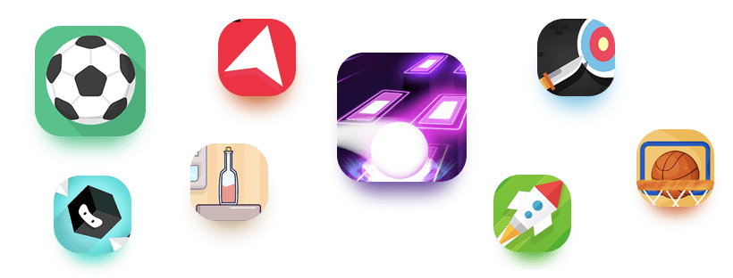

# The Platform

### Sections























### The Games

**WAM.app** publishes simple to play, easy to learn skill games generally called hyper casual games. These games do not require any type of previous knowledge from the player nor does it require vast amounts of time invested in mastering them. This makes hyper casual games a favourite game genre for a very big audience: in 2020 1.5 billion people considered themselves hyper casual players.

### **How you play and win Rewards**

The games published on WAM are diverse and different, each having its own easy to learn mechanics. This is also where the novelty of the platform comes from: no matter what the game is, you can compete with other players on the games you like.\
\
One can continue from a certain score (up to 3 times) by either paying a small fee in WAM Coins or by watching a rewarded ad.\
\
Once the 3 tries are over, the game is automatically reset to 0 so everyone has the same opportunity to win, independently of a user’s funds.

### **Play to Earn**

There are 4 walls: Amateur, Semi-Pro, Pro and Legend. This is a natural progression of skill, just like in real life. The more advanced the tournament, the more expensive is the entry fee which in turn makes for a bigger pool of WAM Coins.

### **Tournaments**

This will be a special type of tournament where the entry is not based on a fee but by owning a specific NFT. Users will have a chance at winning a % of the prize pool without having to pay an entrance fee.

### **The Marketplace**

This is where users will be able to buy Jinxes (NFTs with special abilities like blocking a player mid-game to save the score), avatars, nicknames.

### **Creator Tools**

Each user will be able to create:

* games using AI technology
* tournaments where each user sets the rules and shares the tournament with friends or social following
* NFTs to add as gifts in tournaments

### **Developer program**

Third party developer will be able to publish games on WAM and earn revenue from the tournaments made on their games**.**
